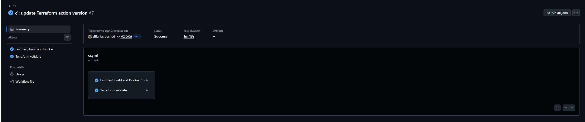

# Evidencia de pipeline CI/CD

## Objetivo

Validar que el proyecto `devops-tasks-api` cuenta con un pipeline automatizado en GitHub Actions para controlar calidad, pruebas, compilación, construcción de imagen Docker y validación de infraestructura Terraform.

## Workflow utilizado

El workflow se encuentra en:

```text
.github/workflows/ci.yml
```

Se ejecuta automáticamente ante:

* Push a la rama `main`.
* Pull request hacia la rama `main`.

## Jobs del pipeline

El workflow está dividido en dos jobs principales:

| Job                            | Propósito                                                                   |
| ------------------------------ | --------------------------------------------------------------------------- |
| `Lint, test, build and Docker` | Validar la aplicación NestJS y construir la imagen Docker.                  |
| `Terraform validate`           | Validar la configuración de infraestructura definida en la carpeta `infra`. |

## Validaciones de la aplicación

El primer job ejecuta las siguientes etapas:

1. Checkout del repositorio.
2. Configuración de Node.js.
3. Habilitación de Corepack.
4. Instalación de dependencias con Yarn.
5. Ejecución de ESLint.
6. Ejecución de tests con Jest.
7. Build de la aplicación NestJS.
8. Construcción de la imagen Docker.

Estas validaciones permiten detectar errores de código, fallos de pruebas, problemas de compilación o fallos en la construcción del contenedor antes de avanzar con nuevos cambios.

## Validaciones de Terraform

El segundo job ejecuta validaciones sobre la infraestructura definida en la carpeta `infra`.

Los comandos ejecutados son:

```bash
terraform fmt -check
terraform init
terraform validate
```

Este job verifica que los archivos Terraform tengan formato correcto, que los providers puedan inicializarse y que la configuración sea válida.

## Alcance de la validación

El pipeline no ejecuta:

```bash
terraform apply
```

Tampoco ejecuta:

```bash
terraform destroy
```

Esto se definió así porque el despliegue local depende de Docker Desktop en la máquina de desarrollo. En esta etapa, GitHub Actions se utiliza para validar la configuración, no para crear infraestructura local.

## Evidencia visual

La siguiente captura muestra una ejecución exitosa del workflow `CI`, con ambos jobs finalizados correctamente:



## Resultado

El pipeline finalizó correctamente, validando:

* Código fuente de la aplicación.
* Pruebas automáticas.
* Build de NestJS.
* Construcción de imagen Docker.
* Formato y validez de archivos Terraform.

## Conclusión

El proyecto cuenta con un pipeline CI/CD inicial funcional. Este pipeline permite automatizar controles básicos de calidad, verificar la construcción del contenedor y validar la infraestructura como código antes de integrar nuevos cambios.