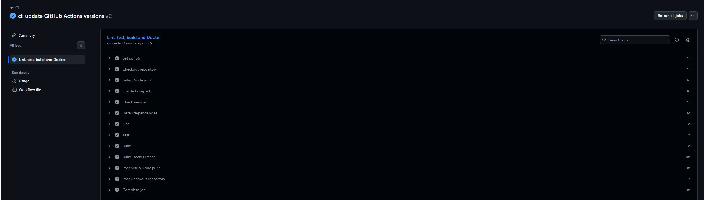

# Evidencias del Proyecto Integrador DevOps

Esta carpeta contiene capturas y evidencias del avance del proyecto integrador.

## Pipeline de GitHub Actions

El pipeline de GitHub Actions ejecuta automáticamente lint, tests, build y construcción de la imagen Docker ante cada push o pull request hacia `main`.

La siguiente captura muestra una ejecución exitosa del workflow `CI`:

## Validaciones incluidas en el pipeline

El workflow ejecuta las siguientes etapas:

1. Checkout del repositorio.
2. Configuración de Node.js.
3. Instalación de dependencias con Yarn.
4. Ejecución de ESLint.
5. Ejecución de tests con Jest.
6. Build de la aplicación NestJS.
7. Construcción de la imagen Docker.

Esta evidencia será utilizada en la documentación final del Proyecto Integrador para demostrar el funcionamiento del pipeline CI/CD.